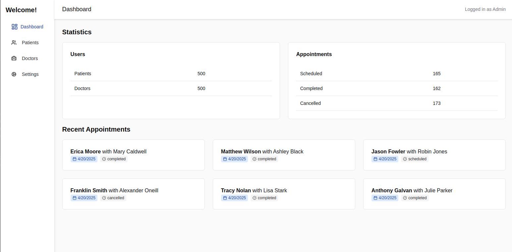

# 🩺 Health Dashboard

A fullstack medical admin dashboard built with:

- 🧠 **NestJS** (TypeScript) + **PostgreSQL** using TypeORM
- ⚛️ **React** + **Vite** + **Chakra UI**
- 🧱 **Monorepo** setup with `pnpm` workspaces and shared types
- 🧪 Mock data generation with realistic relationships (500+ records)

This project simulates a healthcare admin panel where doctors, patients, appointments, and lab results are managed through a clean dashboard interface.

---

## ✨ Features

- **Dashboard stats**: total patients, doctors, appointment status breakdown
- **Recent appointments**: date, doctor/patient, status badges
- **Relational database**: normalized with foreign keys
- **Shared types**: synced across backend and frontend
- **Scalable monorepo**: clean structure for real-world dev teams
- **DevContainer ready**: instant setup in VSCode

---

## 📸 Preview



---

## 📦 Tech Stack

| Layer     | Stack                       |
|-----------|-----------------------------|
| Backend   | NestJS + TypeORM + Postgres |
| Frontend  | React + Vite + Chakra UI    |
| Dev Tools | pnpm + DevContainers        |

---

## 🚀 Getting Started

### 1. Clone and install

```bash
git clone https://github.com/yourusername/health-dashboard.git
```

### 2. Start the dev containers

Using VSCode + DevContainers:

- Open project in container
- PostgreSQL + pgAdmin included in `docker-compose.yml`

### 3. Seed the database

```bash
psql -U postgres -d postgres -f mock_data.sql
```

### 4. Run the backend

```bash
pnpm dev:api
```

Backend will be available at [http://localhost:3001](http://localhost:3001)

### 5. Run the frontend

```bash
pnpm dev:app
```

Frontend will be available at [http://localhost:5174](http://localhost:5174)

---

## 📁 Project Structure

```
packages/
  common/types/     # Shared TypeScript types
platform/
  api/              # NestJS + TypeORM backend
  app/              # Vite + React frontend
```

---

## 🧠 Why I Built This

I created this dashboard to simulate a realistic fullstack environment, practice data modeling, and demonstrate software engineering best practices in a modern stack. It was designed with maintainability, reusability, and real-world team workflows in mind.

---

## 🧑‍💻 Author

**Santiago "Momo" Marín**  
Fullstack Engineer - Focused on clean architecture, DX, and product value

[LinkedIn](https://linkedin.com/in/stgogm) · [GitHub](https://github.com/stgogm)
